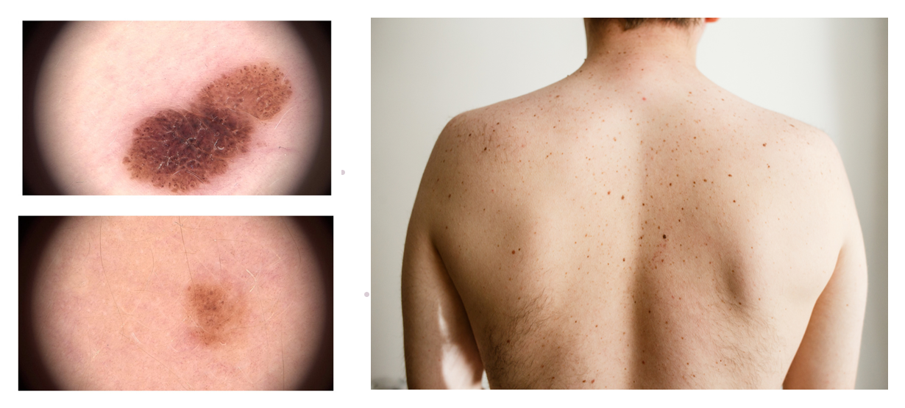
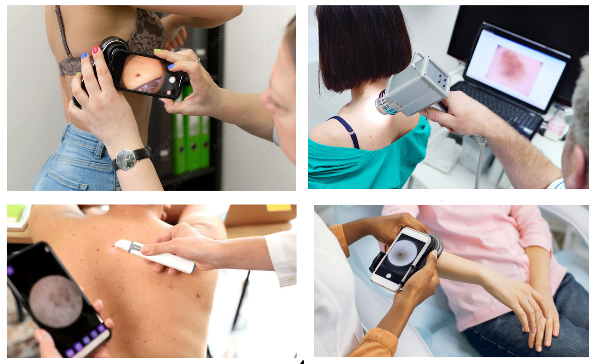
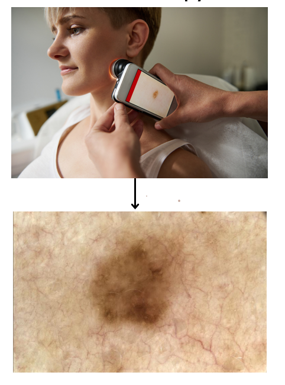
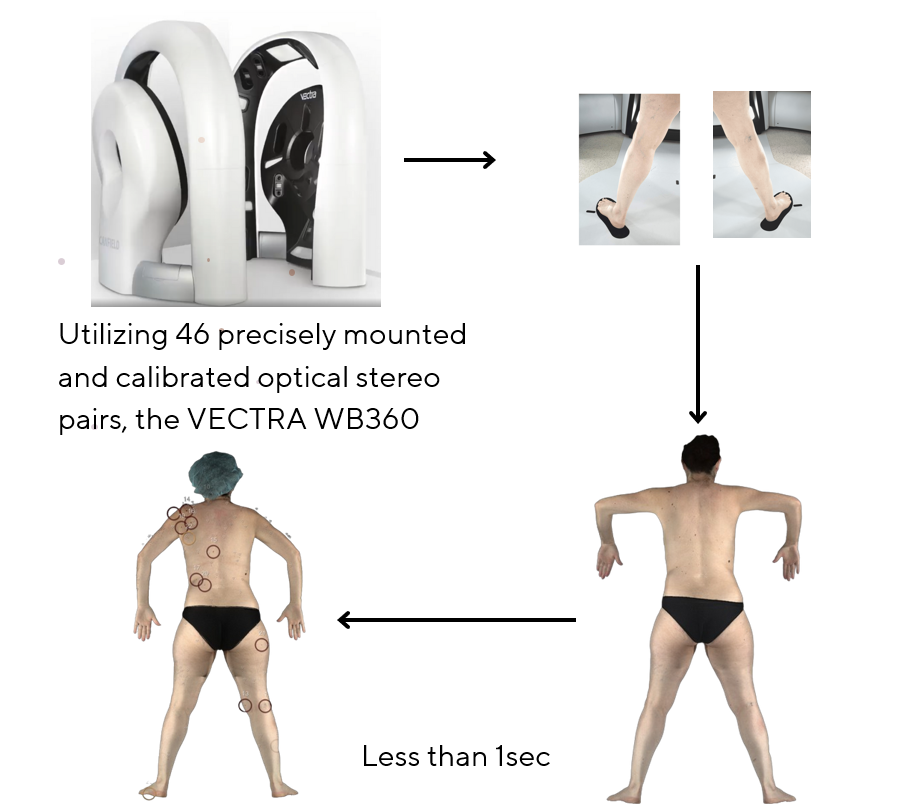
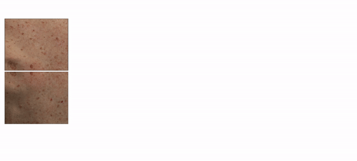
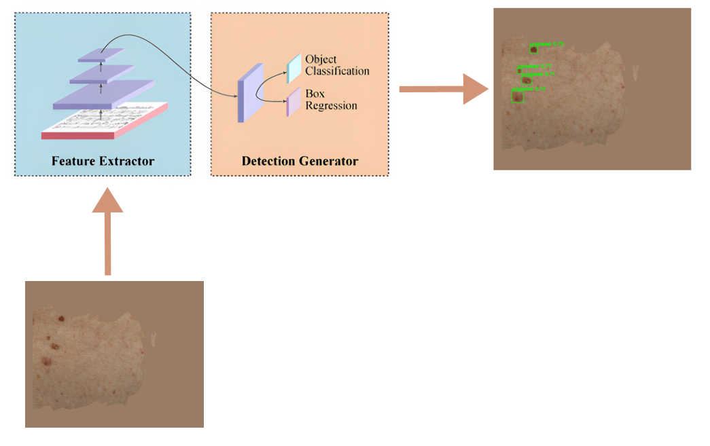
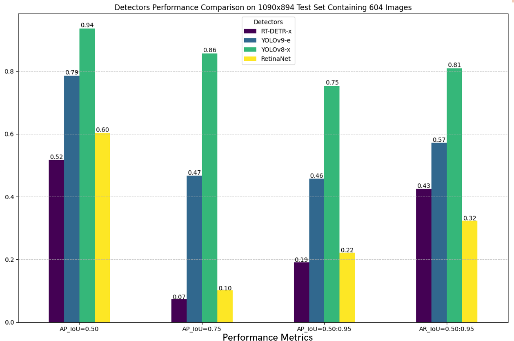
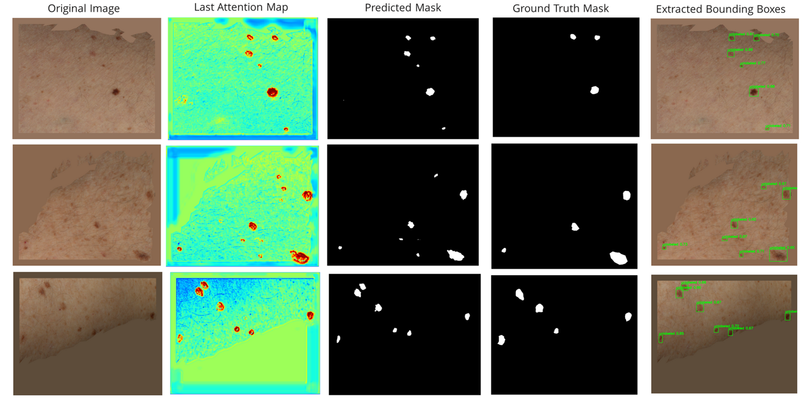

# Pigmented Skin Lesion Detection in Clinical Images Using Deep Learning Methodologies

## by Joseph Adeola

### Advisors
- Prof. Rafael Garcia - ViCOROB, University of Girona
- Asst Prof. Tamara Petrovic - FER, University of Zagreb

### Erasmus Mundus Joint Master in Intelligent Field Robotic Systems Thesis 2024

---

## Table of Contents
1. [Introduction](#introduction)
2. [Motivation](#motivation)
3. [Background](#background)
4. [Methodology](#methodology)
5. [Results](#results)
6. [Conclusion](#conclusion)

---

## Introduction
Pigmented skin lesions refer to any skin abnormality that appears darker than the surrounding area due to melanin or blood. These lesions range from benign moles to malignant melanoma. Early detection and accurate diagnosis are crucial for effective treatment.

---

## Motivation
According to the World Health Organization (WHO), skin cancer represents a significant portion of all cancer diagnoses globally, contributing considerably to cancer-related health burdens and fatalities. In 2022, approximately 1.2 million new cases of non-melanoma skin cancer were reported worldwide, along with 331,722 new cases of melanoma, resulting in 58,667 deaths. This trend is particularly evident in countries such as the United States, Australia, Canada, and Brazil.

<table>
  <tr>
    <td>
      
    </td>
    <td>
      
    </td>
  </tr>
</table>

---

## Background
Several efforts have been made to improve the early diagnosis of skin lesions that can lead to skin cancer, as early diagnosis of melanoma can lead to a 95% survival rate.

### Traditional Diagnosis Technique
Traditional diagnosis relies on dermoscopy, a non-invasive technique where a dermatologist uses a dermoscope to capture images of individual lesions on a patient's skin for further inspection and analysis.

### State-of-the-Art
While dermoscopy has been quite helpful, it is time-consuming and requires specialized dermatological expertise. Over the years, several efforts have been made to automate early lesion diagnosis and monitoring. The Canfield WB360 VECTRA scanner stands as the current standard in automated total body photography lesion-based monitoring. This system, with 46 calibrated stereo pairs, captures images of the patient's skin, 3d reconstructs the skin and provides a model that can be used for continous lesion monitoring.

<table>
  <tr>
    <td>
      
    </td>
    <td>
      
    </td>
  </tr>
</table>

### Dermoscopy vs Clinical Images
The major challenge with diagnosis using clinical images lies in the differences in magnification, lighting, and detail.

| **Aspect**         | **Dermoscopy**                               | **Clinical Images**                           |
|--------------------|----------------------------------------------|----------------------------------------------|
| **Magnification**  | High magnification                           | Lower magnification                          |
| **Lighting**       | Controlled, polarized lighting               | Natural or varied lighting conditions        |
| **Detail**         | Fine details of skin surface                 | Overall view of the skin                     |

---
## Methodology

### Data Acquisition Pipeline
We used the Canfield WB360 scanner to capture detailed images of the skin. High-resolution 3D images were captured from a sample of 28 patients at the Clinical Hospital of Barcelona. The system, equipped with 46 stereo vision pods, captures comprehensive images of each patient's entire skin surface in a single session. We then removed identifiable features such as head, tattoos, and scars using an inpainting technique to preserve patient privacy. The 3D total body avatar was then divided into smaller, overlapping tiles measuring 1090x894 pixels.

### Data Preprocessing
After tile division, we removed areas that are not orthogonal to camera viewpoints to ensure that each lesion is viewed from an optimal angle. This is done by using the average of non-black pixels. We then recovered boundary lesions (lesions that fall on the edges of valid and non-valid areas).

After preprocessing, we divided the dataset into 70%, 20%, and 10% for training, validation, and testing, respectively. The dataset consists of 3288 images for training, 823 for validation, and 604 images for testing.

| **Dataset** | **Number of Lesions** | **Distribution (%)** | **Mean (mm)** | **SD (mm)** |
|-------------|------------------------|-----------------------|---------------|-------------|
| **Training** | <3mm: 3572            | <3mm: 36.2%           | 4.07          | ±1: 6.91    |
|             | 3-5mm: 4242           | 3-5mm: 42.8%          |               | ±2: 9.75    |
|             | >5mm: 2091            | >5mm: 21.1%           |               | ±3: 12.58   |
|             | **Total: 9905**       |                       |               |             |
| **Validation** | <3mm: 813         | <3mm: 34.7%           | 4.18          | ±1: 7.31    |
|             | 3-5mm: 1014           | 3-5mm: 43.3%          |               | ±2: 10.46   |
|             | >5mm: 517             | >5mm: 22.0%           |               | ±3: 13.56   |
|             | **Total: 2344**       |                       |               |             |
| **Testing** | <3mm: 222             | <3mm: 15.8%           | 4.94          | ±1: 8.94    |
|             | 3-5mm: 646            | 3-5mm: 46.0%          |               | ±2: 11.95   |
|             | >5mm: 534             | >5mm: 38.1%           |               | ±3: 16.62   |
|             | **Total: 1402**       |                       |               |             |

### Model Architecture
We evaluated several model architectures to identify the most effective one for our task, focusing on one-stage and two-stage object detectors, segmentation-based models, and unsupervised approaches. These architectures include YOLOv8, YOLOv9, RetinaNet, Real-Time Detection Transformer, Faster-RCNN, Mask-RCNN, UNet, Attention-UNet, ResNet-UNet, DEYO, DINO, and CutLER.

### Model Ensemble
We explored the possibility of ensembling both detectors and segmentation models to leverage the strengths of each individual model. The ensemble approach helps reduce variance, improve robustness, and enhance the overall accuracy of the detection system. We used three ensembling methods:
- **Affirmative Approach**: This method considers a detection valid if any of the models in the ensemble identifies a lesion.
- **Consensus Approach**: This method requires a majority of the models to agree on a detection for it to be considered valid.
- **Unanimous Approach**: This method only considers a detection valid if all models in the ensemble agree.

## Results
In comparing model performance, we used standard object detection metrics such as average precision, average recall, precision, recall, and F1-score. To set a baseline, we used the lesion detector provided by Canfield, which is the best lesion detector for clinical images.

### Quantitative Performance of Canfield Baseline on Test Dataset
The Canfield baseline model was evaluated on a test dataset, showing robust performance metrics. This provided a benchmark for comparing the performance of our proposed models.

### Qualitative Performance of Canfield Baseline on Test Dataset
The image below showcases a sample of the Canfield baseline model's detections on the test dataset.

### Quantitative Performance Comparison of Detectors on Test Dataset
A comparative analysis of different detection models was conducted to identify the best performer. Models were compared based on their average precision and average recall values. The best-performing model was the YOLOv8-x model with an average precision at IOU threshold of 0.5.

### Qualitative Performance Comparison of Best Detector and Canfield Baseline on Test Dataset
The figure below shows some actual detections from the YOLOv8-x model, which was the best-performing detector among all models explored.

We observed that when we used black pixels to remove non-valid areas, the model made the right decisions for the wrong reasons, as shown by the noisy Grad-CAM. Using the average of non-black pixels helped the model focus better on actual lesion features.

### Attention-UNet Visualization for Skin Lesion Segmentation
The Attention-UNet model's segmentation results were visualized to assess its performance. The attention map shows that the model focuses on actual lesion features.

### Quantitative Performance Comparison of Segmentation Models
Segmentation models were compared quantitatively to examine if there was an improvement in performance compared to the detectors. The goal of adding segmentation to the task is to improve lesion localization and boundary delineation. The results show that the YOLOv8-x-segmentation model had the best performance compared to other models.

### Qualitative Performance Comparison of Detector Ensemble Techniques
We compared the performance of ensembling four detection models (YOLOv8-x, YOLOv9-e, RTDETR, RetinaNet) and five segmentation models (YOLOv8-x-seg, YOLOv9-e-seg, UNet, Attention-UNet & ResNet UNet) using the three ensemble techniques discussed earlier. The results show that the best ensembling method in terms of average precision performance is the affirmative method of ensembling detectors, as shown by the plot in the figure below. While this method has a higher AP, it generates more false positives and has a lower F1-score compared to the consensus method of ensembling detectors.

| **Model**                   | **F1-Score** |
|-----------------------------|--------------|
| Canfield Baseline           | 0.82         |
| Best Detector (YOLOv8-x)    | 0.89         |
| Best Segmentation (YOLOv8-x-seg) | 0.91    |
| Best Ensemble (Affirmative) | 0.87         |

## Conclusion

### Conclusion & Future Work
Significant improvements were observed compared to the baseline, showing promising results for early diagnosis and continuous lesion monitoring. The study demonstrated the potential of deep learning methodologies in enhancing the accuracy and efficiency of skin lesion detection.

### Future Work
- Implement a learning-based hair removal strategy.
- Test the model on a larger dataset.
- Validate the model in a real-world setting.

