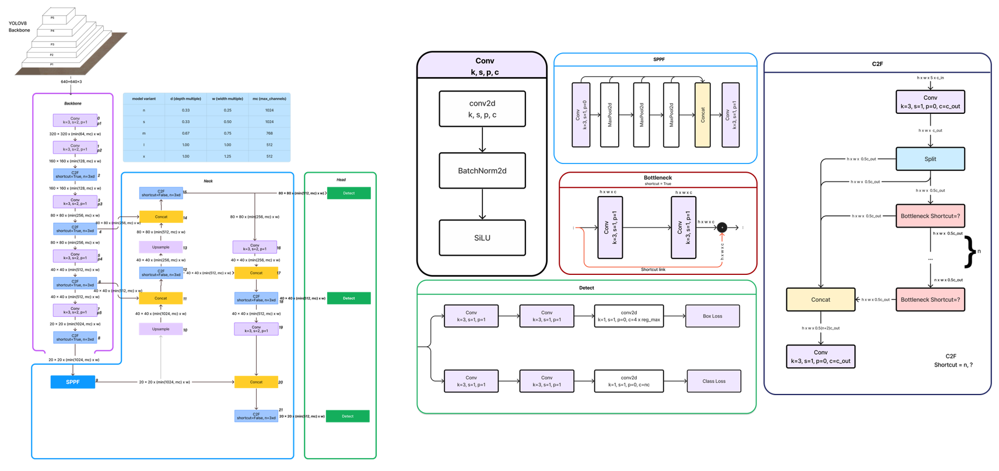
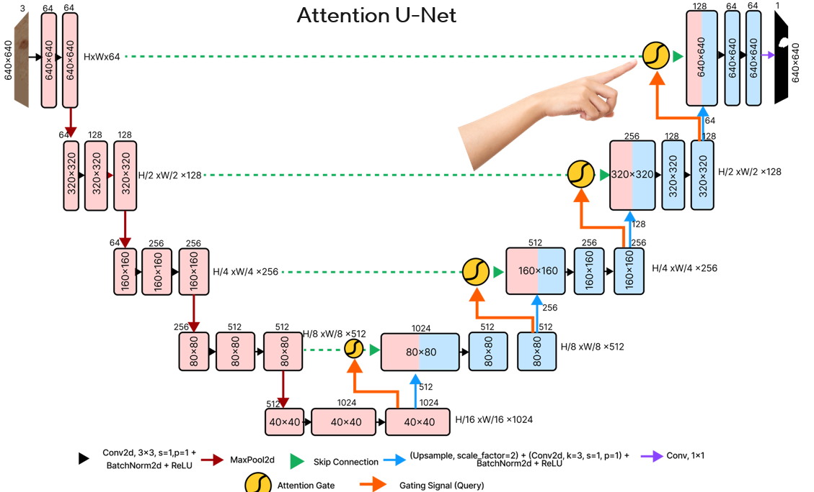
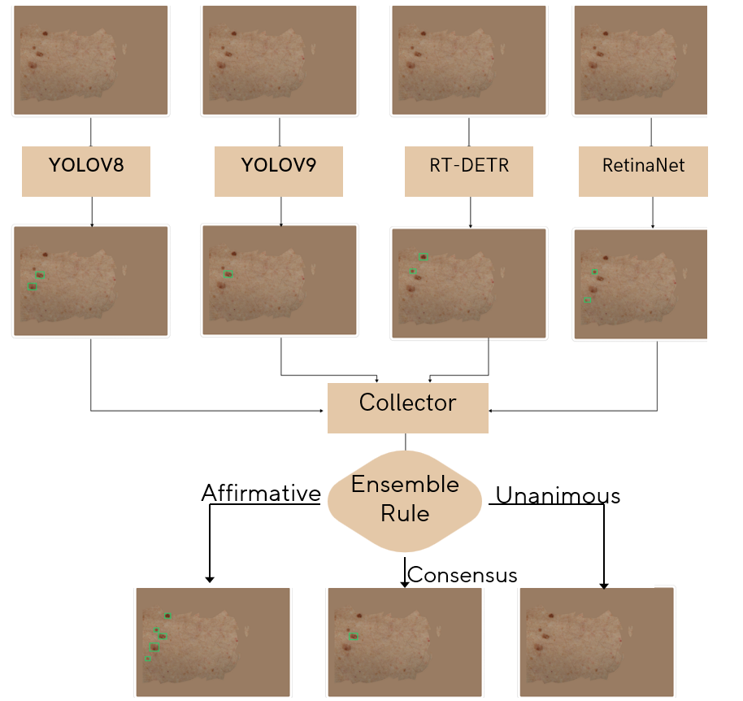
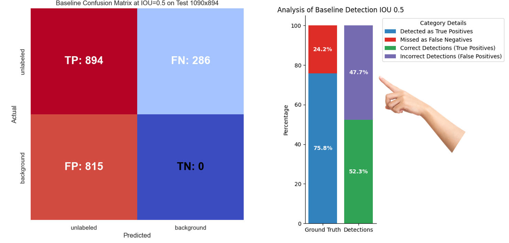
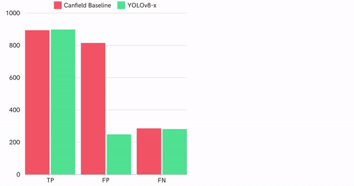

# Pigmented Skin Lesion Detection in Clinical Images Using Deep Learning Methodologies

## by
Joseph Adeola

### Advisors
- Prof. Rafael Garcia - ViCOROB University of Girona
- Asst Prof. Tamara Petrovic - FER University of Zagreb

### Erasmus Mundus Joint Master in Intelligent Field Robotic Systems Thesis 2024

---

## Table of Contents
1. [Introduction](#introduction)
2. [Motivation](#motivation)
3. [Background](#background)
4. [Literature Review](#literature-review)
5. [Methodology](#methodology)
6. [Results](#results)
7. [Conclusion](#conclusion)

---

## Introduction
Pigmented skin lesions refer to any skin abnormality that appears darker than the surrounding area due to melanin or blood. They range from benign moles to malignant melanoma.

---

## Motivation
According to the World Health Organization (WHO), skin cancer represents a considerable share of all cancer diagnoses globally, contributing significantly to cancer-related health burdens and fatalities.

 Globally, the incidence of skin cancer is on the rise, highlighting it as a profound health con
cern that necessitates improved methods for diagnosis and treatment. According to the World
 Health Organization (WHO), skin cancer represents a considerable share of all cancer diagnoses
 globally, contributing significantly to cancer-related health burdens and fatalities. In 2022, there
 were approximately 1.2 million new cases of non-melanoma skin cancer worldwide, along
 with 331,722 new cases of melanoma, a more aggressive form of skin cancer, resulting in 58,667
 deaths. This trend is particularly evident in countries such as the United States, Australia,
 Canada, and Brazil, where the frequency of skin cancer cases continues to increase.
<!--  -->
<!--  -->
<table>
  <tr>
    <td>
      
    </td>
    <td>
      
    </td>
  </tr>
</table>
---

## Background
Several efforts have been made to improve the early diagnosis of skin lesions that can lead to skin cancers, since early diagnosis of melanoma of the skin 
can lead to 95% survival
### Traditional Diagnosis Technique
Traditional diagnosis techniques relies on dermoscopy. Dermoscopy is a non-invasive techique where a dermatologist uses a device called a dermoscope to capture
images of individual lesions on patient's skin for further inspection and analysis later.
<!--  -->

### State-of-the-Art
While dermoscopy has been quite helpful, it is time consuming and requires specialized dermatological expertise, so over the years, several efforts have been made
by researchers and organisations to automate early lesion diagnosis and monitoring. Of all these, the Canfield WB360 VECTRA scanner stands as the current
standard in alternative automated total body photography lesion based monitoring. This system with 46 calibrated stereo pairs, captures images of the patients skin and re
<table>
  <tr>
    <td>
      
    </td>
    <td>
      
    </td>
  </tr>
</table>

### Dermoscopy vs Clinical Image
The major challenge with diagnosis using clinical images lies in 
<!--  -->

ADD A TABLE SHOWING DIFFERENCE BETWEEN DERMOSCOPY AND CLINICAL IMAGES - DONT WRITE TOO MUCH, JUST THREE DIFERENCES, MAGNIFICATION, LIGHTING AND DETAIL

## Methodology

### Data Acquisition Pipeline
We used the CanfieldWB360 scanner

### Data Preprocessing

### Model Architecture Selection

### YOLOv8

### Segmentation Approach

### Model Ensemble

---

## Results

### Quantitative Performance of Canfield Baseline on Test Dataset

### Qualitative Performance of Canfield Baseline on Test Dataset

### Quantitative Performance Comparison of Detectors Test Dataset

### Qualitative Performance of Best Detector

### Attention-UNet Visualization for Skin Lesion Segmentation

### Quantitative Performance Comparison of Segmentation Models

### Qualitative Performance Comparison of Detector Ensemble Techniques

---

## Conclusion

### Conclusion & Future Work
Significant improvement compared to the baseline.

Promising results for early diagnosis and continuous lesion monitoring.

### Future Work
- Implement a learning-based hair removal strategy.
- Test the model on a larger dataset.
- Validate the model in a real-world setting.

---

Thank you!
